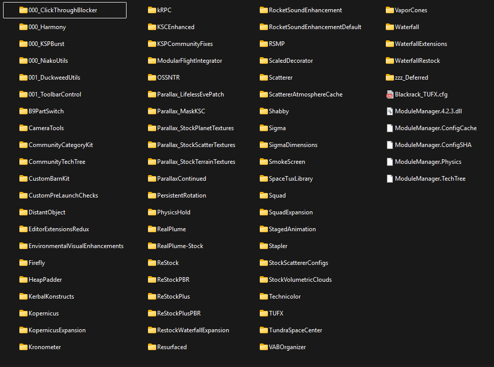

Parallax Mask KSC + 2.7x Resize *(optional)*
==========================================
***for Kerbal Space Program*** *by KsNewSpace aka. Lukas*

*
this is how a correct mask should look like in debug colors -> see config file to enable it
*

Simple mod to mask out the Kerbal Space Center from Parallax scatters using a custom black and white mask. This mod as is, is adapted to a 2.7x size "KSCEnhanced" (Using a simple SigmaDimensions config tweak). You will have to mod it to fit it to your needs. For troubleshooting you can enable red / green debug colors in the config. 

Derived from the [Official Tutorial](https://github.com/Gameslinx/Parallax-Continued/wiki/Scatters-%E2%80%90-Stopping-Scatters-from-Growing-Inside-Buildings) for the ~~lazy~~ efficient people. ;P

# Installation

## Download

Github Mirror: [Parallax_MaskKSC/releases](https://github.com/KsNewSpace/Parallax_MaskKSC/releases)

## Copy Files

Paste the downloaded folder into your GameData folder like so

> Kerbal Space Program\GameData\Parallax_MaskKSC\mask_ksc_MM.cfg

> Kerbal Space Program\GameData\Parallax_MaskKSC\PluginData\mask_ksc.dds

To create your own mask land on the VAB, in the center of the Helipads, zoom all the way in using Alt + Scroll, then zoom out using just scroll until you see the whole KSC. Create a screenshot. Paint the mask black on white background. Flip the mask vertically (mirror not rotate). Save as .dds file (DXT1 with mipmaps on). Exporting to dds can be done with for example [Krita](https://krita.org/) + [DDS Export](https://github.com/esuriddick/Programming/tree/main/Python/Krita/DDS_File_Exporter) Python Plugin Script 

## Dependencies

- [Parallax-Continued](https://github.com/Gameslinx/Parallax-Continued) obviously

## Optional

For a true plug and play solution your KSC should have the same size as mine (2.7x). I provide my Sigma and Parallax settings files separately.

- [KSCEnhanced](https://forum.kerbalspaceprogram.com/topic/225356-ksc-enhanced/)
- [SigmaDimensions](https://github.com/Sigma88/Sigma-Dimensions) using my 2.7x settings.cfg
- [Sigma Replacements](https://github.com/Sigma88/Sigma-Replacements)

## Known Issues

- I have to tinker with Kronometer or other settings to make the daytime make a little more sense. It should be 12 hours but it isn't?

My Complete Mod List
====================
***Please check every mod for dependencies in case I forget to list them***

*
This could be your KSP
*

To download a mod on Github check the right side for "Releases". There you can download the latest mod as a zip file. Please check every mod for dependencies listed on the main page or the KSP forums in case I forget to list them.

# Audio - Visual (mostly)

- [Restock & Restock+](https://github.com/PorktoberRevolution/ReStocked) (Complete revamp of the stock parts plus stock-ish parts that Squad forgot)
  - [RestockPBR](https://github.com/PorktoberRevolution/ReStockPBR) (New PBR materials + re-color for Restock parts)
- [Volumetric Cloud v3](https://www.patreon.com/posts/true-volumetric-87982960) (I use v5 but that one is paywalled)
- [ParallaxContinued](https://github.com/Gameslinx/Parallax-Continued/) (Greatly improved ground scatter and parallax effects for all planets)
- [Firefly](https://github.com/M1rageDev/Firefly/) (Revamped reentry effects)
- [Waterfall](https://github.com/post-kerbin-mining-corporation/Waterfall) (Framework for new engine effects that expand with atmospheric pressure)
  - [Restock Waterfall](https://spacedock.info/mod/3149/Restock%20Waterfall%20Expansion) (Waterfall Configs for Restock, contains its dependencies)
  - [RSMP](https://github.com/dangaffa/RSMP) (Configs for SRBs)
- [TUFX](https://github.com/KSPModStewards/TUFX/) (Post processing effects for KSP to make it look nicer)
- [Deferred](https://github.com/LGhassen/Deferred/) (Rendering upgrade for KSP + Screenspace Reflections)
- [Resurfaced](https://github.com/Tantares/Resurfaced) (Shader upgrade for KSP)
- [VaporCones](https://spacedock.info/mod/3805/VaporCones) (Adds vapor cones at transonic speeds. Can be annoying if you fly that speed constantly)
- [RocketSoundEnhancement](https://github.com/KSPModStewards/RocketSoundEnhancement) (Framework to make better sounds)
  - [RSEDefault](https://github.com/KSPModStewards/RocketSoundEnhancementDefault) (Default configs for RSE. Also adds sonic booms, wheel squeek, propeller sounds and more)
- ...

# Functional

- [Persistant Rotation](https://github.com/linuxgurugamer/PersistentRotation) (allows crafts to maintain their rotation / aim during time warp)
- [Kerbal Konstructs](https://github.com/KSP-RO/Kerbal-Konstructs/) (Allows you to place structures on planets. For example new runways and buildings)
  - [KSCEnhanced](https://spacedock.info/mod/3654/KSC%20Enhanced%20-%20JNSQ) (Expands KSC with more runways, launch pads and overall fuller design)
- [Community Tech Tree](https://github.com/post-kerbin-mining-corporation/CommunityTechTree) (Integrates parts added by many mods into the Tech Tree)
- [CameraTools](https://github.com/BrettRyland/CameraTools) (Move the ingame camera freely for epic shots. I also use it for the smooth following camera on planes (Dogfight))
- [Distant Object Enhancement](https://github.com/net-lisias-ksp/DistantObject) (Puts real stars into the sky you can hover over to check their names and more)
- [Physics Hold](https://github.com/gotmachine/PhysicsHold) (Allows you to turn off physics of large craft for better performance (stations and colonies). Docking still works!)
- [kRPC](https://github.com/krpc/krpc) (Allows you to start a server within KSP to connect and play KSP from the outside using code. [Documentation](https://krpc.github.io/krpc/))
- [Kronometer](https://github.com/linuxgurugamer/Kronometer/) (Allows you to manipulate the clock in KSP)
- ...

# Quality of Life

- [VAB Organizer](https://github.com/post-kerbin-mining-corporation/VABOrganizer) (Organizes parts and gives them colored icons based on size similar to KSP2)
- [ClickthroughBlocker](https://github.com/linuxgurugamer/ClickThroughBlocker) (Annoyed by clicking on a popup window but suddenly you grab a part of your rocket...?)
- [Community Fixes](https://github.com/KSPModdingLibs/KSPCommunityFixes) (A big patch for KSP that fixes a lot of bugs. Most notably improved loading times.)
- ...

# Mod Dependencies

- [Module Manager](https://github.com/KSP-ModularManagement/ModuleManager) (Loads mods into KSP in a somewhat ordered manner using configs - something_MM.cfg)
- [Omega Structures](https://spacedock.info/mod/2061/Omega%27s%20Stockalike%20Structures:%20No%20Textures%20Required) (KSC parts that can be used by Kerbal Konstructs)
- [Tundra's Space Center](https://spacedock.info/mod/1831/Tundra's%20Space%20Center) Launch Pads that can be used by Kerbal Konstrukts
- [Toolbar Control](https://github.com/linuxgurugamer/ToolbarControl) (Helps mods to manage toolbar icons)
- [Shabby](https://github.com/KSPModdingLibs/Shabby) (Shader assets bundle loader)
- [Harmony](https://github.com/KSPModdingLibs/HarmonyKSP) (Tools for modders)
- [KSP Burst](https://github.com/KSPModdingLibs/KSPBurst/) (Burst compiler to make mods run better & cross platform)
- [SpaceTuxLibrary](https://github.com/linuxgurugamer/SpaceTuxLibrary) (useful functions for mods like color pickers)
- Technicolor - bundles with RestockPBR
- ...

To be continued!
  

