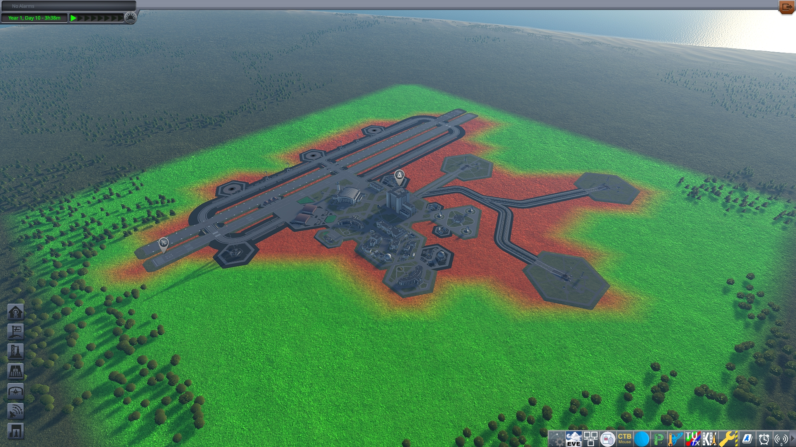

K's Mask KSC for ParallaxContinued Scatter + 2.7x Resize *(optional)*
==========================================
***for Kerbal Space Program*** *by Lukas K. aka KsNewSpace*

*
this is how a correct mask should look like in debug colors -> see config file to enable it
*

Simple mod to mask out the Kerbal Space Center from Parallax scatters using a custom black and white mask. This mod as is, is adapted to a 2.7x size "KSCEnhanced" (Using a simple SigmaDimensions config tweak). You will have to mod it to fit it to your needs. For troubleshooting you can enable red / green debug colors in the config. 

Derived from the [Official Tutorial](https://github.com/Gameslinx/Parallax-Continued/wiki/Scatters-%E2%80%90-Stopping-Scatters-from-Growing-Inside-Buildings) for the ~~lazy~~ efficient people. ;P

# Installation

## Download

Github Mirror: [Parallax_MaskKSC/releases](https://github.com/KsNewSpace/Parallax_MaskKSC/releases) (v1.2 latest zip file)

## Copy Files

Paste the downloaded folder into your GameData folder like so

> Kerbal Space Program\GameData\Parallax_MaskKSC\mask_ksc_MM.cfg

> Kerbal Space Program\GameData\Parallax_MaskKSC\PluginData\mask_ksc.dds

To create your own mask land on the VAB, in the center of the Helipads, zoom all the way in using Alt + Scroll, then zoom out using just scroll until you see the whole KSC. Create a screenshot. Paint the mask black on white background. Flip the mask vertically (mirror not rotate). Save as .dds file (DXT1 with mipmaps on). Exporting to dds can be done with for example [Krita](https://krita.org/) + [DDS Export](https://github.com/esuriddick/Programming/tree/main/Python/Krita/DDS_File_Exporter) Python Plugin Script 

## Minimum Dependencies

- [Parallax-Continued](https://github.com/Gameslinx/Parallax-Continued) obviously

## Optional

For a true plug and play solution your KSC should have the same size as mine (2.7x). I provide my Sigma and Parallax settings files separately.

- [KSCEnhanced](https://forum.kerbalspaceprogram.com/topic/225356-ksc-enhanced/)
- [SigmaDimensions](https://github.com/Sigma88/Sigma-Dimensions) using my 2.7x settings.cfg
- [Sigma Replacements](https://github.com/Sigma88/Sigma-Replacements)

Copy the content of the optional GameData folder into your GameData folder. Make backups of the settings files this will overwrite if you want to keep them. (Working on a better way than this)

## Known Issues

- I have to tinker with Kronometer or other settings to make the daytime make a little more sense. It should be ~12 hours on 2.7x scale but it isn't?

My Complete Mod List: [K's Stockalike Overhaul](https://github.com/KsNewSpace/Ks_Stockalike_Overhaul)
====================

*
This could be your KSP
*
